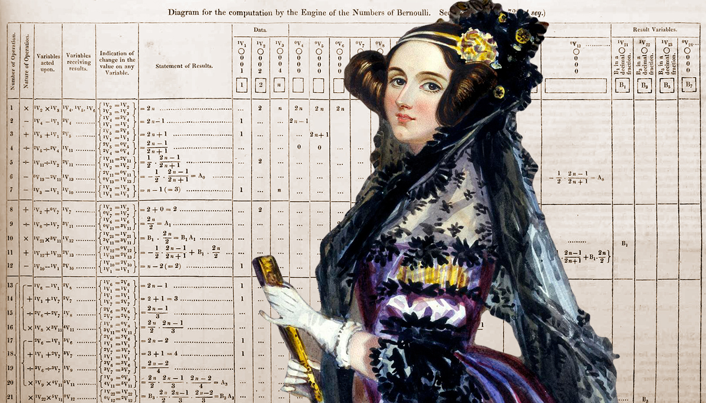

## Bernoulli's equation with TypeScript

The Bernoulli equation is, in essence, a more general and mathematical form of the Bernoulli principle that also takes into account variations in the gravitational potential energy.

The equation is obtained from the Theorem of Conservation of Mechanical Energy and the relationship between mechanical work and the energy of bodies.

### About this project

Project created to learn more about TypeScript typing and the logic of the Bernoulli equation inspired by Ada Lovelace's algorithm.

To run:

1. Install dependencies: `npm install`
2. Build with TypeScript: `npm run build`
3. Start the app: `npm start`

To run dev:

1. Run dev: `npm run dev`

## Description in Portuguese

A equação de Bernoulli é, em sua essência, uma forma mais geral e matemática do princípio de Bernoulli que também leva em consideração variações na energia potencial gravitacional.

A equação é obtida a partir do Teorema da Conservação de Energia Mecânica e da relação entre o trabalho mecânico e a energia dos corpos.

Bernoulli's principle is widely used in fluid mechanics, and its equation is used to describe the behavior of fluids in motion within a tube.

### Sobre este projeto

Projeto criado para aprender mais sobre a tipagem TypeScript e a lógica da equação de Bernoulli inspirado no algoritmo de Ada Lovelace.

Para executar:

1. Instale as dependências: `npm install`
2. Construir com TypeScript: `npm run build`
3. Executar a aplicação: `npm start`

Para compilar e rodar:

1. Construir e Executar: `npm run dev`

## References

[Ada Lovelace's Note G](https://projectlovelace.net/problems/ada-lovelaces-note-g/) - https://projectlovelace.net/problems/ada-lovelaces-note-g/

[Ada and the First Computer](docs/Ada_and_the_First_Computer.pdf)

[Bernoulli Equation](https://brilliant.org/wiki/bernoullis-equation/) from https://brilliant.org/wiki/bernoullis-equation/

[Jakob Bernoulli](https://pt.wikipedia.org/wiki/Jakob_Bernoulli) - https://pt.wikipedia.org/wiki/Jakob_Bernoulli
